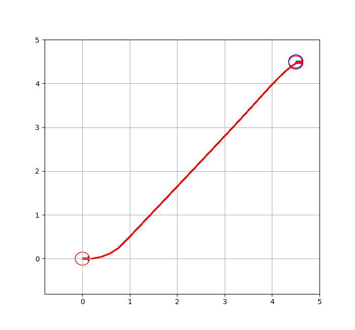
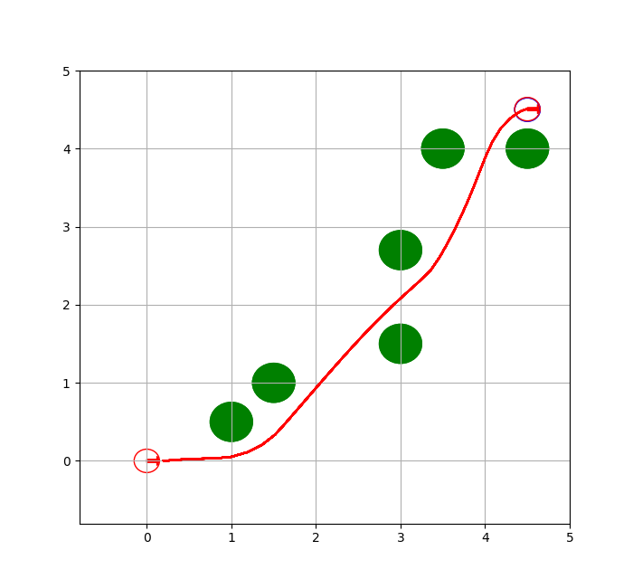
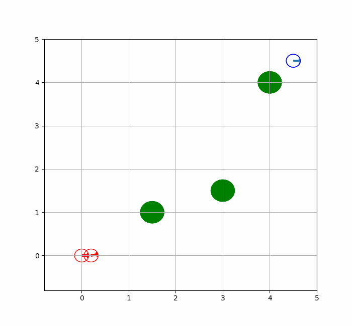
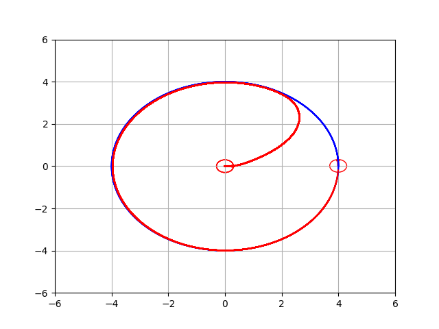
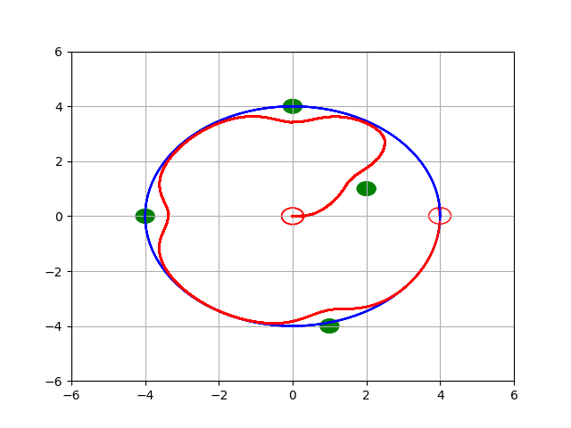
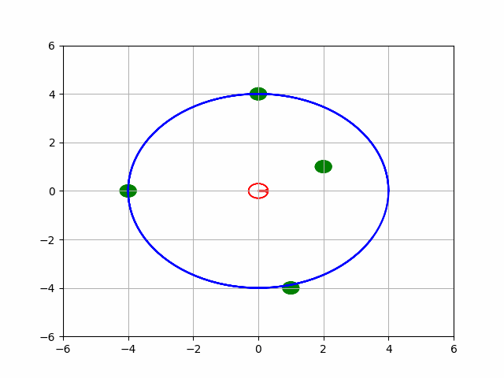

# Nonlinear MPC using CasADi and Python

Applying Nonlinear MPC for Mobile Robot in simulation using Python3

## Robot model
Model: Three Omni-wheeled directional Mobile robot 
State: $ [x, y, \theta]^T $ 
Control: $ [v_x, v_y, \omega]^T $ 
Constraints:
$$ -1.0 \leq v_x, v_y \leq 1.0 $$
$$ -\frac{\pi}{3} \leq \omega \leq \frac{\pi}{3} $$

## Tasks:
* Sim 2 - Moving to target position
* Sim 3 - Moving to target position and avoid static obstacles
* Sim 4 - Tracking the desired path
* Sim 5 - Tracking the desired path and avoid static obstacles

## Results
### Sim 2

### Sim 3

### Sim 4

### Sim 5

